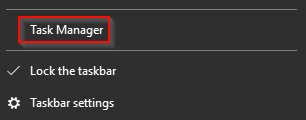

# #23: Core Windows Processes (Part 1)

# Task 2: Task Manager

- **Purpose**: Built-in Windows GUI utility to view running processes, monitor resource usage (CPU, memory), and terminate unresponsive programs.
- **How to Open**: Right-click Taskbar > Select **Task Manager**.
    
    
    
- **Initial View**: Shows minimal info if no apps are open; click **More details** to expand.
    
    
    
- **Tabs**: Default is **Processes** tab; additional tabs may appear depending on the system.
    
    
    
- **Process Categories**:
    - **Apps**: User-launched applications.
    - **Background processes**: System or app processes running in the background.
    - **Windows processes**: Core system processes (e.g., `svchost.exe`).
- **Default Columns** (Processes tab):
    - **Name**: Process name.
    - **Status**: Running or suspended.
    - **CPU**: CPU usage by the process.
    - **Memory**: Physical memory used by the process.

- **Customizable Columns**: Right-click column headers to add:
    - **Type**: Category (Apps, Background, Windows process).
    - **Publisher**: Program/file author.
    - **PID**: Unique process identifier assigned by Windows.
    - **Process name**: File name of the process (e.g., `Taskmgr.exe` for Task Manager).
    - **Command line**: Full command used to launch the process.
    - **Image path name**: File path of the process executable.

- **Use Case**: Troubleshoot issues or analyze endpoints by checking for outliers (e.g., unexpected paths or commands for processes like `svchost.exe`).

### Details Tab

- **Purpose**: Provides detailed process information, including core Windows processes.
- **Sorting**: Sort by **PID** (ascending) to organize processes.
- **Recommended Columns**:
    
    
    
    - **Image path name**: Shows executable file path (e.g., for `svchost.exe`, expected path is `C:\\Windows\\System32\\svchost.exe`).
    - **Command line**: Shows the command used to launch the process.
- **Outlier Detection**: Anomalous paths or commands for processes (e.g., `svchost.exe` with unexpected path) indicate need for deeper analysis.

### Limitations of Task Manager

- **Missing Info**: Lacks parent-child process relationships (e.g., `svchost.exe` should have `services.exe` as parent; Task Manager doesn’t show this).
- **Example Issue**: A process like `svchost.exe` (PID 384) appearing before `services.exe` (PID 632) in Task Manager can be misleading without parent-child context.
    
    
    

### Alternative Tools

- **Process Hacker** and **Process Explorer**:
    
    
    
    - Provide parent-child process views and more detailed process information.
    
    
    
    - Preferred for in-depth analysis over Task Manager.
- **Command-Line Tools** for Process Info:
    - **tasklist**: Lists running processes.
    - **Get-Process (ps)**: PowerShell cmdlet for process details.
    - **wmic**: Command-line tool for process and system information.

# Task 3: System

- **Definition**: The **System** process (PID 4) is a special process in Windows that hosts **kernel-mode system threads**.
- **Role** (per *Windows Internals 6th Edition*):
    - Runs only in **kernel mode**, executing code in system space (e.g., `Ntoskrnl.exe` or device drivers).
    - Unlike user-mode threads, system threads lack a user process address space and allocate memory from OS heaps (paged or nonpaged pool).
    - Has attributes like regular threads (e.g., hardware context, priority) but operates solely in kernel mode.

### Modes Explained

- **User Mode**: Where user applications run; limited access to system resources for safety.
- **Kernel Mode**: Where the OS and drivers run; full access to hardware and system resources.

### Normal Behavior of System Process

- **Using Process Explorer**:
    - **Image Path**: Not applicable (N/A).
    - **Parent Process**: None.
    - **Number of Instances**: One.
    - **User Account**: Local System.
    - **Start Time**: At system boot.

- **Using Process Hacker**:
    - **Image Path**: `C:\\Windows\\system32\\ntoskrnl.exe` (NT OS Kernel).
    - **Parent Process**: System Idle Process (PID 0).
    - **Verification**: Marked as verified (legitimate Microsoft Windows process).

### Unusual Behavior (Indicators of Issues)

- **Parent Process**: Any parent other than **System Idle Process (0)**.
- **Multiple Instances**: More than one System process running.
- **PID**: Any PID other than **4**.
- **Session**: Not running in **Session 0** (System should always run in Session 0).

# Task 4: System > smss.exe

### Overview

- **Role**: The **smss.exe** (Windows Session Manager) is the first user-mode process started by the kernel, responsible for creating new sessions and initializing key Windows subsystems.
- **Function**:
    - Starts kernel and user modes of the Windows subsystem (`win32k.sys`, `winsrv.dll`, `csrss.exe`).
    - Creates environment variables and virtual memory paging files.
    - Launches critical processes in **Session 0** (isolated OS session) and **Session 1** (user session).

### Process Spawning

- **Session 0**: Spawns:
    
    
    
    
    
    - **csrss.exe** (Client/Server Runtime Subsystem).
    - **wininit.exe**.
- **Session 1**: Spawns:
    
    
    
    
    
    - **csrss.exe**.
    - **winlogon.exe** (Windows Logon Manager).
- **Behavior**: Master `smss.exe` creates a child instance per session; child copies itself into the new session and self-terminates after setup.
- **Additional Subsystems**: Launches any subsystems listed in the registry at `HKLM\\System\\CurrentControlSet\\Control\\Session Manager\\Subsystems`.
    
    
    

### Normal Behavior

- **Image Path**: `%SystemRoot%\\System32\\smss.exe` (typically `C:\\Windows\\System32\\smss.exe`).
- **Parent Process**: **System** (PID 4).
- **Number of Instances**: One master instance; one child instance per session (child exits after session creation).0
- **User Account**: Local System.
- **Start Time**: Master instance starts within seconds of boot.

### Unusual Behavior (Indicators of Issues)

- **Parent Process**: Any parent other than **System** (PID 4).
- **Image Path**: Not `C:\\Windows\\System32\\smss.exe`.
- **Number of Instances**: More than one persistent process (children should self-terminate).
- **User Account**: Not running as SYSTEM user.
- **Registry**: Unexpected entries in `HKLM\\System\\CurrentControlSet\\Control\\Session Manager\\Subsystems`.

# Task 5: csrss.exe

- **Role**: The **csrss.exe** (Client Server Runtime Process) is the user-mode component of the Windows subsystem, critical for system operation.
- **Functions**:
    - Manages Win32 console windows and process/thread creation and deletion.
    - Loads `csrsrv.dll`, `basesrv.dll`, `winsrv.dll`, and other DLLs.
    - Provides Windows API access to other processes.
    - Handles drive letter mapping and Windows shutdown processes.
- **Importance**: Termination causes system failure (Blue Screen of Death).
- **Spawning**: Initiated by `smss.exe` in **Session 0** (OS session) and **Session 1** (user session) at startup.

### Normal Behavior

- **Image Path**: `%SystemRoot%\\System32\\csrss.exe` (typically `C:\\Windows\\System32\\csrss.exe`).
- **Parent Process**: Spawned by an instance of `smss.exe` (which self-terminates, so no active parent is listed).
- **Number of Instances**: Two or more (one for Session 0, one for Session 1, additional for new sessions).
- **User Account**: Local System.
- **Start Time**: First two instances (Session 0 and 1) start within seconds of boot; additional instances start as new sessions are created (typically only Sessions 0 and 1 exist).

### Unusual Behavior (Indicators of Issues)

- **Parent Process**: Any active parent process (since `smss.exe` self-terminates after spawning).
- **Image Path**: Not `C:\\Windows\\System32\\csrss.exe`.
- **Misspellings**: Subtle name variations (e.g., `csrs.exe` or `cssrs.exe`) to mask rogue processes.
- **User Account**: Not running as SYSTEM user.