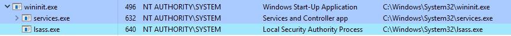

# #24: Core Windows Processes (Part 2)

# Task 6: wininit.exe

- **Role**: The **wininit.exe** process is a critical Windows process running in **Session 0** (isolated OS session), responsible for launching key system processes.
    
    
    
- **Functions**: Starts:
    - **services.exe**: Service Control Manager.
    - **lsass.exe**: Local Security Authority.
    - **lsaiso.exe**: Associated with Credential Guard and KeyGuard (only if Credential Guard is enabled).
- **Importance**: Runs in the background with its child processes, essential for system operation.

### Normal Behavior


- **Image Path**: `%SystemRoot%\\System32\\wininit.exe` (typically `C:\\Windows\\System32\\wininit.exe`).
- **Parent Process**: Spawned by an instance of `smss.exe` (which self-terminates, so no active parent is listed).
- **Number of Instances**: One.
- **User Account**: Local System.
- **Start Time**: Starts within seconds of system boot.

### Unusual Behavior (Indicators of Issues)

- **Parent Process**: Any active parent process (since `smss.exe` self-terminates after spawning).
- **Image Path**: Not `C:\\Windows\\System32\\wininit.exe`.
- **Misspellings**: Subtle name variations (e.g., `winit.exe`) to mask rogue processes.
- **Number of Instances**: More than one instance running.
- **User Account**: Not running as SYSTEM user.

# Task 7: wininit.exe > services.exe

- **Role**: The **services.exe** process, known as the Service Control Manager (SCM), manages system services, including loading, interacting with, and starting/stopping services.
- **Functions**:
    - Maintains a service database, queryable via the **sc.exe** command-line tool.
        
        ```bash
        C:\Users\Administrator> sc.exe
        DESCRIPTION:
                SC is a command line program used for communicating with the
                Service Control Manager and services.
        USAGE:
                sc <server> [command] [service name] <option1> <option2>...
        ```
        
    - Stores service information in the registry at `HKLM\\System\\CurrentControlSet\\Services`.
        
        
        
    - Loads auto-start device drivers into memory.
    - Updates the **Last Known Good Configuration** (`HKLM\\System\\Select\\LastKnownGood`) to match `CurrentControlSet` upon successful user login.
        
        
        
    - Acts as the parent process for key processes like `svchost.exe`, `spoolsv.exe`, `msmpeng.exe`, and `dllhost.exe`.
        
        
        

### Normal Behavior


- **Image Path**: `%SystemRoot%\\System32\\services.exe` (typically `C:\\Windows\\System32\\services.exe`).
- **Parent Process**: **wininit.exe**.
- **Number of Instances**: One.
- **User Account**: Local System.
- **Start Time**: Starts within seconds of system boot.

### Unusual Behavior (Indicators of Issues)

- **Parent Process**: Any parent other than **wininit.exe**.
- **Image Path**: Not `C:\\Windows\\System32\\services.exe`.
- **Misspellings**: Subtle name variations (e.g., `servces.exe`) to mask rogue processes.
- **Number of Instances**: More than one instance running.
- **User Account**: Not running as SYSTEM user.

# Task 8: wininit.exe > services.exe > svchost.exe


- **Role**: The **svchost.exe** (Host Process for Windows Services) hosts and manages Windows services implemented as DLLs.
- **Function**:
    - Services are stored as DLLs, with their paths defined in the registry under `HKLM\\SYSTEM\\CurrentControlSet\\Services\\SERVICE_NAME\\Parameters\\ServiceDLL`.
        - The example below is the ServiceDLL value for the Dcomlaunch service.
            
            
            
    - Groups similar services to share the same process using the **k** parameter to reduce resource consumption.
    - Starting with **Windows 10 Version 1703**, on systems with >3.5 GB of memory, each service may run in its own `svchost.exe` process.
- **Common Target for Malware**: Adversaries may:
    - Name malware `svchost.exe` or use misspellings (e.g., `scvhost.exe`).
    - Install/call malicious DLLs to hide among legitimate services.

### Viewing in Process Hacker


- To view this information from within Process Hacker, right-click the svchost.exe process. In this case, it will be PID 748.
    
    
    
- Right-click the service and select Properties. Look at Service DLL.
    
    
    
- From the above screenshot, the Binary Path is listed. .
    - Example: For the **Dcomlaunch** service, the binary path includes the **k Dcomlaunch** parameter.
- Different services (e.g., **LSM**) have unique `ServiceDLL` values in the registry.

### Normal Behavior


- **Image Path**: `%SystemRoot%\\System32\\svchost.exe` (typically `C:\\Windows\\System32\\svchost.exe`).
- **Parent Process**: **services.exe**.
- **Number of Instances**: Multiple (many instances are normal due to service grouping).
- **User Account**: Varies (SYSTEM, Network Service, Local Service, or logged-in user in Windows 10).
- **Start Time**: Typically starts within seconds of boot; additional instances may start later.
- **Command Line**: Includes the **k** parameter to group services (e.g., `k Dcomlaunch`).

### Unusual Behavior (Indicators of Issues)

- **Parent Process**: Any parent other than **services.exe**.
- **Image Path**: Not `C:\\Windows\\System32\\svchost.exe`.
- **Misspellings**: Subtle name variations (e.g., `scvhost.exe`) to mask rogue processes.
- **Command Line**: Missing the **k** parameter in the binary path.

# Task 9: Lsass.exe

- **Role**: The **lsass.exe** process enforces security policies in Windows, handling user authentication and security token creation.
- **Functions** (per Wikipedia):
    - Verifies users logging into a Windows computer or server.
    - Manages password changes.
    - Creates access tokens for:
        - **SAM** (Security Account Manager).
        - **AD** (Active Directory).
        - **NETLOGON**.
    - Writes to the Windows Security Log.
- **Configuration**: Uses authentication packages specified in the registry at `HKLM\\System\\CurrentControlSet\\Control\\Lsa`.
    
    
    
- **Malware Target**: Adversaries may:
    - Use tools like **Mimikatz** to dump credentials.
    - Name malware `lsass.exe` or use misspellings (e.g., `lasss.exe`) to blend in.

### Normal Behavior


- **Image Path**: `%SystemRoot%\\System32\\lsass.exe` (typically `C:\\Windows\\System32\\lsass.exe`).
- **Parent Process**: **wininit.exe**.
- **Number of Instances**: One.
- **User Account**: Local System.
- **Start Time**: Starts within seconds of system boot.

### Unusual Behavior (Indicators of Issues)

- **Parent Process**: Any parent other than **wininit.exe**.
- **Image Path**: Not `C:\\Windows\\System32\\lsass.exe`.
- **Misspellings**: Subtle name variations (e.g., `lasss.exe`) to mask rogue processes.
- **Number of Instances**: More than one instance running.
- **User Account**: Not running as SYSTEM user.

# Task 10: winlogon.exe

- **Role**: The **winlogon.exe** process manages user logon and logoff operations in Windows.
- **Functions**:
    - Handles the **Secure Attention Sequence (SAS)**: `CTRL+ALT+DELETE` for entering username and password.
    - Loads user profiles by loading `NTUSER.DAT` into the registry at `HKCU` (HKEY_CURRENT_USER).
    - Works with **userinit.exe** to load the user's shell (typically `explorer.exe`).
        
        
        
    - Manages screen locking and running the user's screensaver.
- **Spawning**: Launched by `smss.exe` in **Session 1** (user session) along with `csrss.exe`.
    
    
    
- **Registry**: Configured settings, including the shell, are stored in the registry (e.g., shell value should be `explorer.exe`).

### Normal Behavior


- **Image Path**: `%SystemRoot%\\System32\\winlogon.exe` (typically `C:\\Windows\\System32\\winlogon.exe`).
- **Parent Process**: Spawned by an instance of `smss.exe`, which self-terminates, so no active parent process is listed in analysis tools.
- **Number of Instances**: One or more (one for Session 1; additional instances for new sessions via Remote Desktop or Fast User Switching).
- **User Account**: Local System.
- **Start Time**: First instance starts within seconds of boot; additional instances start with new sessions.

### Unusual Behavior (Indicators of Issues)

- **Parent Process**: Any active parent process (since `smss.exe` self-terminates after spawning).
- **Image Path**: Not `C:\\Windows\\System32\\winlogon.exe`.
- **Misspellings**: Subtle name variations (e.g., `winl0gon.exe`) to mask rogue processes.
- **User Account**: Not running as SYSTEM user.
- **Registry**: Shell value in the registry not set to `explorer.exe`.

# Task 11: explorer.exe

- **Role**: The **explorer.exe** process provides the graphical user interface for accessing folders, files, and core Windows features like the **Start Menu** and **Taskbar**.
- **Spawning**: Launched by **userinit.exe**, which is initiated by **winlogon.exe**. The shell value in the registry (`HKLM\\Software\\Microsoft\\Windows NT\\CurrentVersion\\Winlogon\\Shell`) specifies `explorer.exe`. After spawning, **userinit.exe** exits.
- **Child Processes**: Spawns multiple child processes related to file and interface operations.
    
    
    

### Normal Behavior


- **Image Path**: `%SystemRoot%\\explorer.exe` (typically `C:\\Windows\\explorer.exe`).
- **Parent Process**: Spawned by **userinit.exe**, which exits, so no active parent process is listed in analysis tools.
- **Number of Instances**: One or more per interactively logged-in user.
- **User Account**: Runs as the logged-in user(s).
- **Start Time**: First instance starts when the first interactive user logon session begins.

### Unusual Behavior (Indicators of Issues)

- **Parent Process**: Any active parent process (since `userinit.exe` exits after spawning).
- **Image Path**: Not `C:\\Windows\\explorer.exe`.
- **User Account**: Running as an unknown or unexpected user.
- **Misspellings**: Subtle name variations (e.g., `expl0rer.exe`) to mask rogue processes.
- **Network Activity**: Outbound TCP/IP connections (not typical for `explorer.exe`).


### Key Takeaway

- **explorer.exe** is critical for user interaction with the Windows interface but is a common target for malware due to its prominence. Check for anomalies in path, user, or network behavior to identify potential threats.

---

# Conclusion:

### Windows 10 Core Processes

- **Why It Matters**: Understanding core Windows processes helps defenders spot anomalies (e.g., malware mimicking legitimate processes).
- **lsaiso.exe**:
    - **Role**: Enhances lsass.exe for Credential Guard, isolates credentials using Virtualization-Based Security.
    - **Normal**: Runs only if Credential Guard is enabled; path: C:\Windows\System32\lsaiso.exe; parent: wininit.exe; one instance; Local System; starts at boot.
    - **Unusual**: Present without Credential Guard, high CPU, wrong path, or misspelled name.
- **RuntimeBroker.exe**:
    - **Role**: Manages permissions for Universal Windows Platform (UWP) apps (e.g., Store apps).
    - **Normal**: Path: C:\Windows\System32\RuntimeBroker.exe; parent: often svchost.exe; one or more instances; varies by user; starts with app use; low CPU.
    - **Unusual**: High CPU, unexpected network activity, or running without UWP apps.
- **taskhostw.exe**:
    - **Role**: Hosts DLL-based tasks (e.g., Task Scheduler, Windows Defender features).
    - **Normal**: Path: C:\Windows\System32\taskhostw.exe; parent: services.exe or userinit.exe; multiple instances; varies by user; starts at boot or task trigger.
    - **Unusual**: High CPU, unauthorized access, or frequent AV blocks.
- **Other Processes**: Research fontdrvhost.exe (font rendering) and conhost.exe (console windows) for normal behavior (e.g., low resources, correct paths).