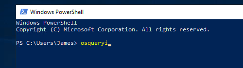

# #29: OsQuery: The basics

# Osquery Investigation Project

## Task 1: Introduction

In this task, I learned about **Osquery**, an open-source tool developed by Facebook in 2014.

- **What it is:** Osquery turns an operating system into a relational database. This allows me to run SQL queries against system data.
- **Why it matters:** It’s widely used by security analysts, incident responders, and threat hunters to monitor endpoints and investigate suspicious activity.
- **Supported platforms:** Windows, Linux, macOS, FreeBSD.
- **Key skills I’ll practice here:**
    - Using Osquery in **interactive mode**.
    - Running **SQL queries** on system data.
    - Exploring **table schemas** and joining tables.

---

## Task 2: Connect with the Lab

For this task, I had to connect to the **preconfigured VM** provided in TryHackMe.

- **Steps I followed:**
    1. Started the VM using the **Show Split View** button in the THM interface.
    2. Used the given credentials to log in:
        - Username: `James`
        - Password: `thm_4n6`
    3. Opened **PowerShell** from the taskbar.
    4. Typed `osqueryi` to launch Osquery in **interactive mode**.
        
        
        

---

## Task 3: Osquery Interactive Mode

Here I explored how to use Osquery interactively.

### Step 1: Launch interactive shell

```powershell
osqueryi
```

### Step 2: Explore commands with `.help`

- `.tables` → Lists available tables.
    - Example: `.tables user` shows all tables with "user" in the name.
- `.schema table_name` → Shows the schema (columns and datatypes).
    - Example: `.schema users` displays columns like `uid`, `username`, `directory`.
- `.mode` → Controls output display formatting. Options: `csv`, `column`, `line`, `list`, `pretty`.

---

### Q1: How many tables are returned when we query “table process”?

- I ran:
    
    ```sql
    .table process
    ```
    
    
    
- This returned **3 results**.

---

### Q2: Which column displays the process ID in the `processes` table?

- I ran:
    
    ```sql
    .schema processes
    ```
    
    
    
- The schema included a column called **pid**, which stands for **Process ID**.

---

### Q3: How many output display modes are available for `.mode`?

- I ran:
    
    ```sql
    .help
    ```
    
    
    
- The output listed **5 display modes**: `csv`, `column`, `line`, `list`, `pretty`.

---

## Task 4: Schema Documentation

For this task, I used the official **Osquery schema documentation**:

👉 [https://osquery.io/schema/5.5.1](https://osquery.io/schema/5.5.1)

This allowed me to:

- Browse **all available tables** by version.
- Filter tables by **OS compatibility** (Linux, Windows, macOS).
- View detailed table structures: names, columns, datatypes, and descriptions.

---

### Q1: In Osquery 5.5.1, how many **common tables** exist for both Linux and Windows?

- On the schema page, I selected **Linux + Windows** in the filter.
    
    
    
- Found **56 common tables**.

---

### Q2: In Osquery 5.5.1, how many tables exist for **macOS**?

- Switched the filter to **macOS only**.
- Found **180 tables**.

---

### Q3: In Windows, which table shows installed programs?

- Browsed the Windows tables list.
    
    
    
- Found the table named **programs**, which contains installed software.

---

### Q4: In Windows, which column contains the **registry value** in the `registry` table?

- Opened the `registry` table schema.
- Found a column named **data**, which holds the registry values.
    
    
    

---

## Task 5: Creating SQL Queries

Here I practiced writing **SQL queries in Osquery**.

### Step 1: Query all installed programs

```sql
SELECT * FROM programs LIMIT 1;
```


### Step 2: Select specific columns

```sql
SELECT name, version, install_location, install_date FROM programs LIMIT 1;
```


### Step 3: Count entries in a table

```sql
SELECT count(*) FROM programs;
```


### Step 4: Filtering with WHERE

```sql
SELECT * FROM users WHERE username='James';
```


### Step 5: Joining tables

```sql
SELECT p.pid, p.name, p.path, u.username
FROM processes p
JOIN users u ON u.uid = p.uid
LIMIT 10;
```


---

### Q1: How many programs are installed on this host?

- I ran:
    
    ```sql
    SELECT count(*) FROM programs;
    ```
    
- This returned **19 programs**.

---

### Q2: What is the description for the user `James`?

- I ran:
    
    ```sql
    SELECT username, description FROM users WHERE username='James';
    ```
    
    
    
- The description for James is **Creative Artist**.

---

### Q3: What is the full SID of the user with RID `1009`?

- I ran:
    
    ```sql
    SELECT path, key, name FROM registry WHERE key = 'HKEY_USERS';
    ```
    
- Looked for the entry ending with `1009`.
- Found the full SID: **S-1-5-21-1966530601-3185510712-10604624-1009**.
    
    
    

---

### Q4: What Internet Explorer extension is installed?

- I ran:
    
    ```sql
    SELECT * FROM ie_extensions;
    ```
    
- Found the installed extension:
    
    
    
    **C:\Windows\System32\ieframe.dll |**
    

---

### Q5: What is the full name of the program returned when searching for Wireshark?

- I ran:
    
    ```sql
    SELECT name, install_location
    FROM programs
    WHERE name LIKE '%wireshark%';
    ```
    
- Found the installed program: **Wireshark 4.4.9 x64**.
    
    
    

---