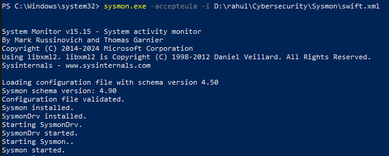

# #27: Sysmon: Monitor and log endpoints and environments

# Sysmon Threat Hunting

## Task 1: Introduction

In this room, I worked with **Sysmon (System Monitor)**, a tool from the Windows Sysinternals package. Sysmon is widely used in enterprises as part of their monitoring and logging solution. It is similar to Windows Event Logs but provides **more detailed and granular control**.

The lab uses a modified version of the **Blue** and **Ice** boxes, along with **Sysmon logs from the Hololive network lab**.

---

## Task 2: Sysmon Overview

Sysmon runs as a **Windows service and driver** that logs detailed system activity into the Windows Event Log. It persists across reboots and helps in detecting **malicious or anomalous behavior** by monitoring:

- Process creation
- Network connections
- File changes

Sysmon events are stored in:

`Event Viewer → Applications and Services Logs → Microsoft → Windows → Sysmon → Operational`

### Sysmon Configuration

Sysmon needs a **configuration file** that controls how events are analyzed and filtered.

- Config files **reduce noise** by filtering out normal/benign activity.
- Common configs:
    - **SwiftOnSecurity Sysmon-Config** (exclusion-based, removes normal activity)
    - **ION-Storm ruleset** (inclusion-based, focuses only on suspicious activity)

### Key Sysmon Event IDs

- **Event ID 1** – Process Creation (detect suspicious processes)
- **Event ID 3** – Network Connection (monitor suspicious binaries/ports)
- **Event ID 7** – Image Loaded (detect DLL injection/hijacking)
- **Event ID 8** – CreateRemoteThread (detect code injection)
- **Event ID 11** – File Created (useful for ransomware detection)
- **Event ID 12–14** – Registry Events (persistence indicators)
- **Event ID 15** – FileCreateStreamHash (detects Alternate Data Streams)
- **Event ID 22** – DNS Event (logs DNS queries; noise can be reduced by excluding common domains)

---

## Task 3: Installing and Preparing Sysmon

### Installation

I installed Sysmon in two ways:

1. **Download directly** from Microsoft Sysinternals website
2. Or, use PowerShell to download all Sysinternals tools at once:
    
    ```powershell
    Download-SysInternalsTools C:\Sysinternals
    ```
    

### Starting Sysmon

1. I opened PowerShell/Command Prompt as **Administrator**
2. Installed Sysmon with a config file (https://github.com/SwiftOnSecurity/sysmon-config):
    
    ```bash
    Sysmon.exe -accepteula -i ..\Configuration\swift.xml
    ```
    
    
    
    - `accepteula` → auto accepts license agreement
    - `i` → installs Sysmon with the given configuration file
3. After installation, I verified logs inside:
    
    
    

```
Event Viewer → Applications and Services Logs → Microsoft → Windows → Sysmon → Operational
```

---

## Task 4: Cutting Out the Noise

Sysmon produces a **huge amount of logs**. To effectively hunt threats, I need to filter out normal activity and focus on suspicious behavior.

### Best Practices

- **Exclude > Include** → It’s safer to exclude known-good events instead of only including specific suspicious ones (to avoid missing threats).
- **Use CLI tools** (Get-WinEvent, wevutil.exe) instead of relying only on GUI. CLI gives **finer control**.
- **Know your environment** → Helps distinguish legitimate vs suspicious activity.

### Filtering Events

1. **Event Viewer** → filter by Event ID and keywords (good for quick checks but limited for large datasets).
2. **PowerShell – Get-WinEvent** → powerful filtering with XPath queries.
    
    Example: Filter for suspicious connections on **port 4444**
    
    ```powershell
    Get-WinEvent -Path <Path to Log> -FilterXPath '*/System/EventID=3 and */EventData/Data[@Name="DestinationPort"] and */EventData/Data=4444'
    ```
    

### Questions

**Q1:** How many Event ID 3 events are in `Filtering.evtx`?

- I opened the `.evtx` file in **Event Viewer**
    
    
    
- Applied **Filter Current Log → Event ID = 3**
- Result: **73,591 events**
    
    
    

**Q2:** What is the UTC time of the first network event?

- I sorted by **Date & Time (ascending)**
- Checked the **Details tab** for full timestamp in UTC
- Found: **2021-01-06 01:35:50.464**
    
    
    

---

## Task 5: Hunting Metasploit

Metasploit is a common pentesting tool, especially for **meterpreter shells**. It usually communicates on suspicious ports like **4444** and **5555**.

### My Investigation Steps

1. **Analyze network traffic** (packet captures for suspicious C2 connections)
2. **Inspect Sysmon logs** (Event ID 3 = Network Connections)
3. **Correlate logs with process IDs** (to find which executable opened suspicious ports)

### Detection Methods

- **Custom Sysmon Rule (Ion-Security)**
    
    Example rule to flag ports 4444 & 5555.
    
- **PowerShell hunting**
    
    ```powershell
    Get-WinEvent -Path <LogFile> -FilterXPath '*/System/EventID=3 and */EventData/Data[@Name="DestinationPort"] and */EventData/Data="4444"'
    ```
    
- Cross-reference with **MITRE ATT&CK** and **Malware Common Ports Spreadsheet**

---

## Task 6: Detecting Mimikatz

Mimikatz is a **credential dumping tool** that targets **LSASS.exe**. I detected it using Sysmon logs and PowerShell.

### Techniques I Used

1. **Detect File Creation**
    - Search for filenames containing “mimikatz”
    - Example Sysmon rule:
        
        ```xml
        <RuleGroup name="" groupRelation="or">
          <FileCreate onmatch="include">
            <TargetFileName condition="contains">mimikatz</TargetFileName>
          </FileCreate>
        </RuleGroup>
        ```
        
2. **Detect Abnormal LSASS Access (Event ID 10)**
    - Normal processes shouldn’t access LSASS except **svchost.exe**
    - Initial detection rule (too noisy): logs all access to lsass.exe
    - Optimized rule (exclude svchost.exe):
        
        ```xml
        <RuleGroup name="" groupRelation="or">
          <ProcessAccess onmatch="exclude">
            <SourceImage condition="image">svchost.exe</SourceImage>
          </ProcessAccess>
          <ProcessAccess onmatch="include">
            <TargetImage condition="image">lsass.exe</TargetImage>
          </ProcessAccess>
        </RuleGroup>
        ```
        
3. **PowerShell Hunting**
    
    Example queries:
    
    ```powershell
    # Detect any access to LSASS
    Get-WinEvent -Path <LogFile> -FilterXPath '*/System/EventID=10 and */EventData/Data[@Name="TargetImage"] and */EventData/Data="C:\Windows\system32\lsass.exe"'
    
    # Detect in Hunting_Mimikatz.evtx
    Get-WinEvent -Path C:\Users\THM-Analyst\Desktop\Scenarios\Practice\Hunting_Mimikatz.evtx -FilterXPath '*/System/EventID=10 and */EventData/Data[@Name="TargetImage"] and */EventData/Data="C:\Windows\system32\lsass.exe"'
    ```
    

---

## Task 7: Hunting Malware

I hunted for **Remote Access Trojans (RATs)** and backdoors.

### Hunting Approach

- **Hypothesis-based hunting**: Start with assumption (e.g., "a RAT is running") and prove/disprove
- **Detect suspicious ports**: RATs often use uncommon ports (e.g., 1034, 1604)
- **Exclude benign traffic** (like OneDrive) to cut noise
- **Beware of overlooked ports**: attackers may hide behind port 53 (DNS)

### PowerShell Hunting Example

```powershell
Get-WinEvent -Path <LogFile> -FilterXPath '*/System/EventID=3 and */EventData/Data[@Name="DestinationPort"] and */EventData/Data=<Port>'
```

---

## Task 8: Hunting Persistence

Persistence keeps attackers inside a system. I focused on:

### Startup Persistence

- Attackers drop malicious executables into **Startup folders**
- Example from `T1023.evtx` → persist.exe in Startup folder

### Registry Key Persistence

- Attackers modify registry keys like `HKLM\SOFTWARE\Microsoft\Windows\CurrentVersion\Run`
- Example from `T1060.evtx` → malicious.exe added to registry Run key

---

## Task 9: Detecting Evasion Techniques

### Alternate Data Streams (ADS)

- ADS hides malicious files inside legitimate ones (NTFS trick)
- Detected with **Sysmon Event ID 15**
- Example from `Hunting_ADS.evtx`:
    
    `not_malicious.txt:malicious.txt:$DATA`
    
- Check ADS manually:
    
    ```powershell
    dir /r
    ```
    

### Remote Threads / DLL Injection

- Attackers create remote threads in legitimate processes
- Detected with **Sysmon Event ID 8**
- Example from `Detecting_RemoteThreads.evtx`: powershell.exe injecting into notepad.exe

### PowerShell Hunting

```powershell
Get-WinEvent -Path <LogFile> -FilterXPath '*/System/EventID=8'
```

---