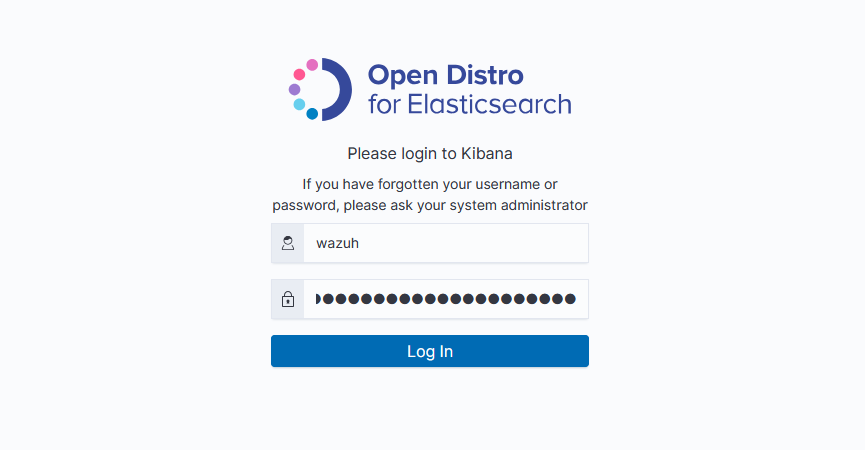
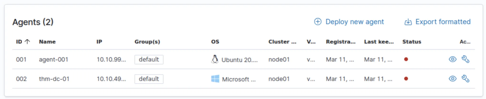
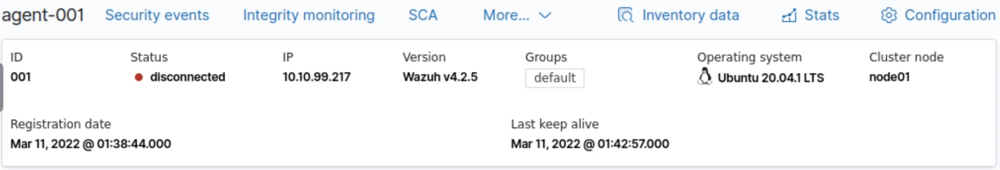
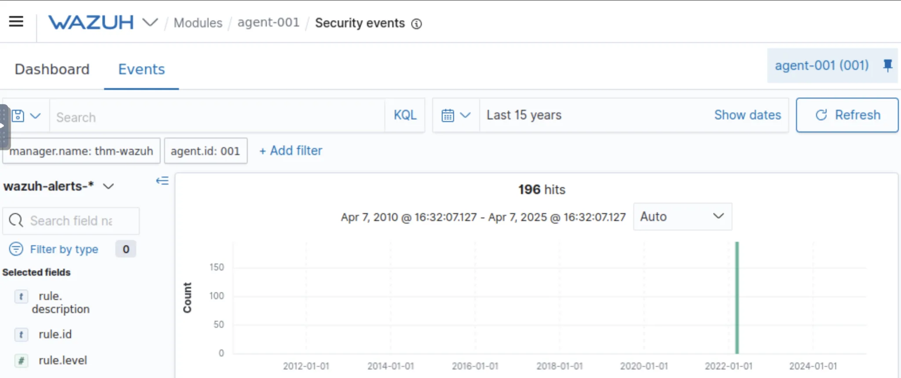

# #31: Wazuh: Threat detect, and integrity monitoring

@Wazuh is a free, open source and enterprise-ready security monitoring solution for threat detection, integrity monitoring.

---

## Task 1 – Introduction

### Objective

Understand what **Wazuh** is, what problems it solves, and how it fits into endpoint detection and response (EDR).

### What I Learned

- Wazuh is an **open-source EDR solution** launched in **2015**.
- It turns ordinary hosts into **monitored endpoints**, analyzing their logs and system activities.
- It uses a **manager–agent model**:
    - **Agent** = monitored device.
    - **Manager** = central server receiving, parsing, and analyzing data from all agents.
- Wazuh detects threats such as:
    - Vulnerabilities and misconfigurations.
    - Real-time attacks like brute-force or privilege escalation.
    - Anomalies and system tampering.
- It provides visualization dashboards, alert rules, and supports plugin and API extensions.

### Answers

- **When was Wazuh released?** → 2015
- **What does Wazuh call a monitored device?** → Agent
- **What manages these devices?** → Manager

---

## Task 2 – Deploy Wazuh Server

### Steps I Followed

1. Connected to the **TryHackMe network**.
2. Deployed the **attached Wazuh management server** VM.
3. Waited ≈ 5 minutes until Kibana finished loading.
4. Accessed the interface through my browser at:
    
    ```
    http://MACHINE_IP
    ```
    
5. Logged in using:
    
    
    
    - Username → `wazuh`
    - Password
6. Selected **Global Tenant** on login.

**Note:** I refreshed after a few minutes when “Kibana Server is not ready yet” appeared.

---

## Task 3 – Wazuh Agents

### Understanding Agents

- Agents are lightweight services installed on devices (Windows, Linux, macOS).
- They monitor events such as authentication, user management, and system modifications.
- Logs are forwarded to the Wazuh Manager for analysis.

### Steps I Performed

1. Logged into the Wazuh server:
    
    ```
    https://<IP>
    ```
    
2. Navigated to **Wazuh → Agents → Deploy New Agent**.
    
    
    
3. In the wizard:
    
    
    
    - Chose the OS of the target device.
    - Provided the **Wazuh Manager’s IP**.
    - Assigned an optional group.
4. Copied the generated install command (Step 4 of wizard) and ran it on the target device.

**Answers**

- **How many agents managed?** → 2
    
    
    
- **Status of agents?**
    
    
    

---

## Task 4 – Vulnerability Assessment & Security Events

### What Wazuh Does

- Each agent is scanned for installed applications and compared against the **CVE database**.
- Configuration path:
    
    ```
    /var/ossec/etc/ossec.conf
    ```
    
- A full vulnerability scan runs on initial agent connection, then every 5 minutes by default.
- It can also trigger **compliance checks** against rulesets (e.g., CIS, GDPR, MITRE).
- Routine operations may appear as security events—these can be filtered by **timestamp**, **description**, or **tactic**.

### Steps I Followed

1. Logged into Wazuh Server → `http://<ip>`.
2. Navigated to **Wazuh → Agents**.
3. Selected the agent named **AGENT-001**.
4. Opened the **Security** **Events** tab.
    
    
    
5. Then clicked on **Events** to go to events tab.
    
    
    
6. Adjusted the date range to include **11 March 2022** (I used “Last 15 years” to capture everything).
    
    
    

### Observation

- The event list showed **196 security event alerts** for AGENT-001.

---

## Task 5 – Policy Auditing

### Concept

Wazuh audits agents’ configurations and policies, mapping them to frameworks like:

- **MITRE ATT&CK**
- **NIST**
- **GDPR**

This module records event logs, compliance scores, and visual analytics. For example, auditing a Windows Domain Controller can reveal configuration drift or security misalignment.

### Steps I Performed

1. Logged into the Wazuh Server (`MACHINE_IP`).
2. Navigated to:
    
    ```
    Wazuh → Modules → Policy Monitoring
    ```
    
    
    
3. Explored the dashboards showing audit status and compliance metrics.

---

## Task 6 – Monitoring Logons with Wazuh

### Concept

- Wazuh tracks both **successful** and **failed** authentication attempts.
- **Rule ID 5710** triggers on failed SSH logins (e.g., invalid or nonexistent users).
- Each alert includes:
    - Source IP
    - Hostname
    - Rule description and MITRE mapping
    - Log location (`/var/ossec/logs/alerts/alerts.log`)
- Successful logins are logged with lower severity, but thresholds can be tuned.
- Visual dashboards make it easier to filter events—for example, narrowing 285 Windows logons to 79 for detailed analysis.

### Steps I Followed

1. Logged into the Wazuh Server (`http://<ip>`).
2. Opened **Wazuh → Management → Rules** to inspect the ruleset definitions.
    
    
    
3. Reviewed Rule 5710 and related authentication rules for Linux and Windows logon events.

---

## Summary of Key Concepts & Commands

| Concept | Explanation |
| --- | --- |
| **EDR (Endpoint Detection & Response)** | Detects and responds to endpoint-level threats through continuous monitoring and analytics. |
| **Agent** | Lightweight client collecting logs and telemetry. |
| **Manager** | Central server analyzing data and issuing alerts. |
| **Vulnerability Module** | Compares software versions to CVE database. |
| **Policy Module** | Checks compliance against frameworks like NIST and GDPR. |
| **Rules Module** | Defines detection signatures (e.g., failed SSH login = Rule 5710). |

---

## Task 7 – Collecting Windows Logs with Wazuh

### Concept

- Windows logs system events using **Sysmon**.
- Sysmon can monitor activities such as authentication, file access, process creation, and PowerShell execution.
- Sysmon’s configuration is managed with an **XML file**, specifying which events to track.
    
    
    
- Wazuh agents collect these events by updating the **ossec.conf** file and restarting the agent.
- On the Wazuh manager, custom rules are added to process and visualize the logs.

### Questions & Answers

- **What tool monitors system events on Windows?** → Sysmon
- **Where are these events recorded on Windows?** → Event Viewer

---

## Task 8 – Collecting Linux Logs with Wazuh

### Concept

- Wazuh agents can collect and analyze Linux logs, similar to Windows.
- Wazuh rules are located in:
    
    ```
    /var/ossec/ruleset/rules
    ```
    
- Commonly monitored applications include:
    - Docker, FTP, WordPress, SQL Server, MongoDB, Firewalld
- Example: To monitor Apache2 logs, specify log location in **ossec.conf**, assign a ruleset (e.g., 0250-apache_rules.xml), then restart the agent.
    
    
    

### Questions & Answers

- **Full path to Wazuh rules on the server:**
    
    ```
    /var/ossec/ruleset/rules
    ```
    

---

## Task 9 – Auditing Commands on Linux with Wazuh

### Concept

- Wazuh integrates with **auditd** to track Linux system commands/events.
- Auditd can monitor actions like root commands, file access, and process execution.
- Steps to configure:
    1. Install auditd and plugins:
        
        ```
        sudo apt-get install auditd audispd-plugins
        sudo systemctl enable auditd.service
        sudo systemctl start auditd.service
        ```
        
    2. Add monitoring rules to `/etc/audit/rules.d/audit.rules`, e.g.:
        
        ```
        -a exit,always -F arch=b64 -F euid=0 -S execve -k audit-wazuh-c
        ```
        
    3. Apply rules:
        
        ```
        sudo auditctl -R /etc/audit/rules.d/audit.rules
        ```
        
    4. Configure Wazuh agent to monitor audit log in **ossec.conf**:
        
        ```
        <localfile>
            <location>/var/log/audit/audit.log</location>
            <log_format>audit</log_format>
        </localfile>
        ```
        
        
        

### Questions & Answers

- **Application used to monitor Linux events:** → auditd
- **Full path of audit rules:**
    
    ```
    /etc/audit/rules.d/audit.rules
    ```
    

---

## Task 10 – Wazuh API

### Concept

- Wazuh Manager provides an API for automation and CLI interactions.
- Authentication yields a **token** for subsequent requests.
- Requests can be made using tools like **curl**.
- Supported HTTP methods: GET, POST, PUT, DELETE.
- The web interface includes an **API console** for easier queries.
    
    
    

### Questions & Answers

- **Tool to make requests to Wazuh API:** → curl
- **HTTP method to retrieve information:** → GET
- **HTTP method to perform an action:** → PUT
- **Wazuh server version (API console):** → v4.2.5

---

## Task 11 – Generating Reports with Wazuh

### Concept

- Wazuh allows generation of security event reports per agent.
- Reports can summarize activity over a specific period (e.g., last 24 hours).
- Steps:
    1. Navigate: **Modules → Security Events**.
        
        
        
    2. Adjust date range or query to include relevant events.
    3. Click **Report** button (enabled when data exists).
        
        
        
    4. Access reports: **Wazuh → Management → Reporting**.
        
        
        
    5. Download PDFs using the save icon.
        
        
        

### Questions & Answers

- **Agent generating the most alerts:** → agent-001

---

## Task 12 – Loading Sample Data

### Concept

- Optional sample data demonstrates Wazuh features without affecting production.
- Steps:
    1. Navigate: **Wazuh → Settings → Sample Data**
        
        
        
    2. Click **Add Data** on each card (3 total).
        
        
        
    3. Wait until buttons change to “Remove Data” (≈1 min per import), it means data is successfully imported.

---